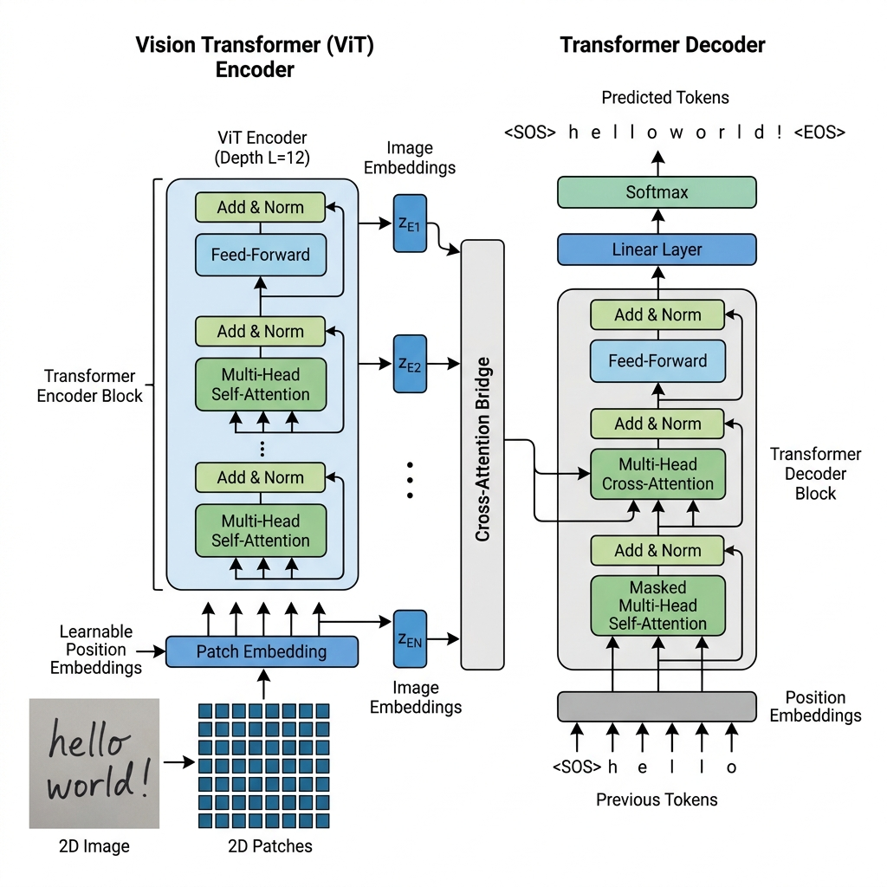

# Hybrid ViT + Transformer OCR Architecture

Tài liệu chi tiết kiến trúc mô hình **Hybrid ViT Encoder (Conv Stem + ViT) + Transformer Decoder** được tối ưu hóa cho nhận dạng chữ tiếng Việt dòng (Cropped Text Line OCR).

---

## 🖼️ Sơ đồ Kiến trúc 2D Tối ưu (Hybrid Architecture Diagram)



---

## 📐 Bảng Biến đổi Kích thước Tensor qua Từng Bước (Tensor Dimensions Step-by-Step)

Dưới đây là chi tiết kích thước Tensor $[B, C, H, W] \rightarrow [B, N, \text{embed\_dim}] \rightarrow [B, L, |V|]$ qua từng khối tính toán:

```text
[1. Input Image]                   (B, 3, 32, 256)
        │
        ▼  Conv Stage 1 (Stride 2x2, Out: 64)
[Conv Stem Layer 1]                (B, 64, 16, 128)
        │
        ▼  Conv Stage 2 (Stride 2x2, Out: 128)
[Conv Stem Layer 2]                (B, 128, 8, 64)
        │
        ▼  Conv Stage 3 (Stride 2x1, Out: 384)
[Conv Stem Layer 3]                (B, 384, 4, 64)
        │
        ▼  Permute & Flatten (N = 4 x 64 = 256)
[Feature Patch Sequence]           (B, N=256, embed_dim=384)
        │
        ▼  Add 2D Positional Embedding
[ViT Encoder Input]                (B, N=256, embed_dim=384)
        │
        ▼  6x Multi-Head Self-Attention Blocks
[Visual Memory Z_enc]              (B, N=256, embed_dim=384)  ◄───┐ (Key, Value)
                                                                 │
[Target Text Tokens]               (B, L)                        │
        │                                                        │
        ▼  Text Token Embedding + Positional Embedding           │
[Decoder Text Input]               (B, L, d_model=384)           │
        │                                                        │
        ▼  Masked Self-Attention                                 │
[Masked Text Features]             (B, L, d_model=384)           │
        │                                                        │
        ▼  Cross-Attention (Query: Text | Key/Value: Z_enc)  ───┘
[Cross-Attended Features]          (B, L, d_model=384)
        │
        ▼  Linear Head Projection (embed_dim -> Vocab Size |V|)
[Output Logits]                    (B, L, |V|)
```

---

## 🎯 Chi tiết Kỹ thuật Các Bước Tính toán

### 1. Đầu vào (Input Image)
- Kích thước: **$[B, 3, 32, 256]$** với $B$ là Batch Size, $C=3$ kênh màu (RGB), Chiều cao $H=32$, Chiều rộng $W=256$.

### 2. Convolutional Stem (3-Stage Feature Extractor)
Gồm 3 lớp Conv2D + BatchNorm + ReLU đóng vai trò trích xuất đặc trưng góc cạnh và các **dấu thanh Tiếng Việt**:
- **Stage 1** (Stride 2x2): $[B, 3, 32, 256] \rightarrow \mathbf{[B, 64, 16, 128]}$
- **Stage 2** (Stride 2x2): $[B, 64, 16, 128] \rightarrow \mathbf{[B, 128, 8, 64]}$
- **Stage 3** (Stride 2x1): $[B, 128, 8, 64] \rightarrow \mathbf{[B, 384, 4, 64]}$ *(Giữ Stride=1 ở chiều rộng để không làm mất độ phân giải ngang của câu chữ)*.

### 3. Reshape & Patch Flattening (Chuyển sang dạng Chuỗi Patch)
- Ma trận đặc trưng 2D $[B, 384, 4, 64]$ được duỗi phẳng (Flatten) chiều không gian $H'=4, W'=64$ thành chuỗi $N$ ô patch:
  $$N = H' \times W' = 4 \times 64 = 256 \text{ patches}$$
- Đổi thứ tự trục (Permute & Reshape):
  $$\mathbf{[B, 384, 4, 64]} \xrightarrow{\text{Permute}} [B, 4, 64, 384] \xrightarrow{\text{Flatten}} \mathbf{[B, N=256, \text{embed\_dim}=384]}$$

### 4. Cộng 2D Positional Embedding
- Tensor Positional Embedding có kích thước **$[1, 256, 384]$** chứa thông tin tọa độ hàng-cột $(y, x)$.
- Phép cộng: $X_{input} = X_{patches} + \text{PosEmb}_{2D} \rightarrow \mathbf{[B, 256, 384]}$.

### 5. ViT Encoder Blocks ($L=6$ Lớp Self-Attention)
- Cho 256 patch vector tương tác qua lại để học ngữ cảnh hình ảnh.
- Đầu ra **Visual Memory $Z_{enc}$**: **$[B, N=256, \text{embed\_dim}=384]$**.

### 6. Transformer Decoder (Cross-Attention & Autoregressive Text Generation)
- **Target Input**: Ký tự dịch phải $[B, L]$ qua Embedding $\rightarrow \mathbf{[B, L, 384]}$ ($L \le 64$).
- **Cross-Attention**:
  - **Query ($Q$)**: Từ chuỗi chữ $[B, L, 384]$.
  - **Key ($K$), Value ($V$)**: Từ Visual Memory $Z_{enc}$ $[B, 256, 384]$.
  - Trọng số Cross-Attention ma trận: $[B, L, 256]$ (mỗi ký tự đang sinh $i$ sẽ "nhìn" vào 256 patch ảnh).
- Đầu ra Decoder: **$[B, L, 384]$**.

### 7. Linear Output Head & Softmax Loss
- Chiếu tuyến tính từ $d_{model}=384 \rightarrow |V|$ (Tổng số ký tự từ điển Tiếng Việt, ví dụ $|V|=230$).
- Output Logits: **$[B, L, |V|]$**.
- Loss: **Cross Entropy Loss** so sánh $[B, L, |V|]$ với Ground Truth Label $[B, L]$.
